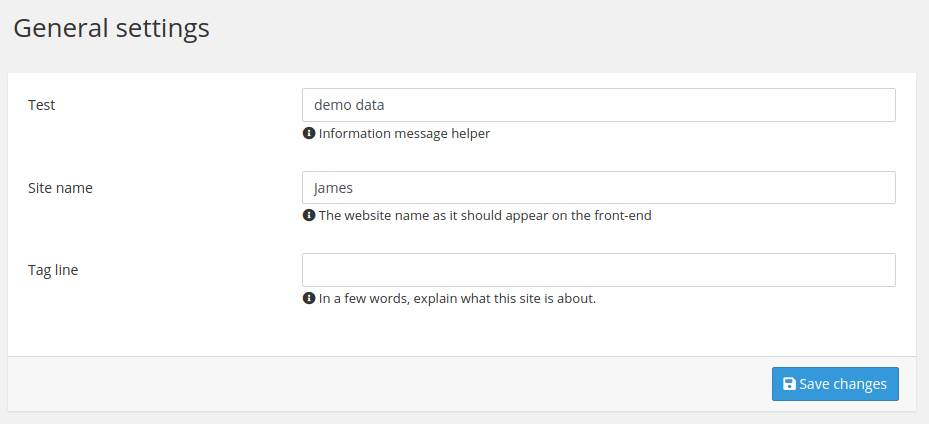

# Chapter 3. Settings everywhere

Settings are a really powerful feature and easy to create in HarmonyCMS.  
However, sometimes you need to add settings to already existing domains.

## Adding settings to the general setting page

General settings page contains main settings for HarmonyCMS such as `site_name`, `tag_line`, ...  
But sometimes, for some reasons, you will need to add settings to the general setting page.

This page list all settings with the `default` domain and the `general` tag. So to add new settings, this is very simple actually.

You can add settings from everywhere \(extensions, themes, bundles and config\).  
Let's take an example. Create the next file with the next content:



```yaml
harmony_settings_manager:
    settings:
        -   name: test
            type: string
            tags: ['general']
            data: 'demo data'
            description: 'Information message helper'
```



This setting configuration will add a new setting field `test` in the general settings page, like:



